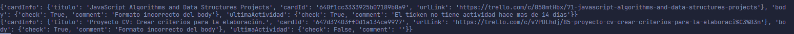

# Trello and GitHub Wraps to create tickets and issues

## .env file

```bash
TRELLO_API_KEY=key
TRELLO_SECRET=secret
TRELLO_TOKEN=token
tablero=idTrelloBoard 
list=idTrelloList 
sticker=idTrelloCustomSticker
member=idTrelloMemberToAdd
color_tags=blue_light #Default Color of tags
```
## Check all tickets in a list for format and last activity

